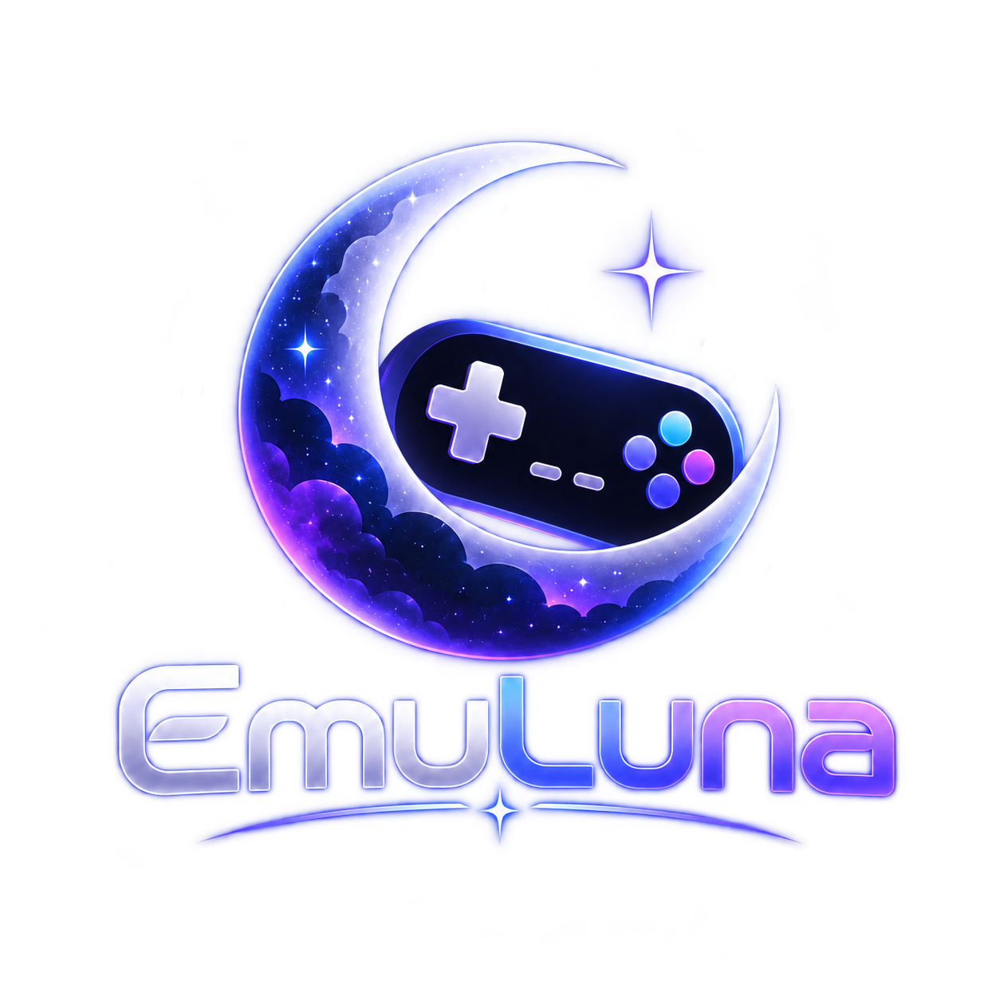
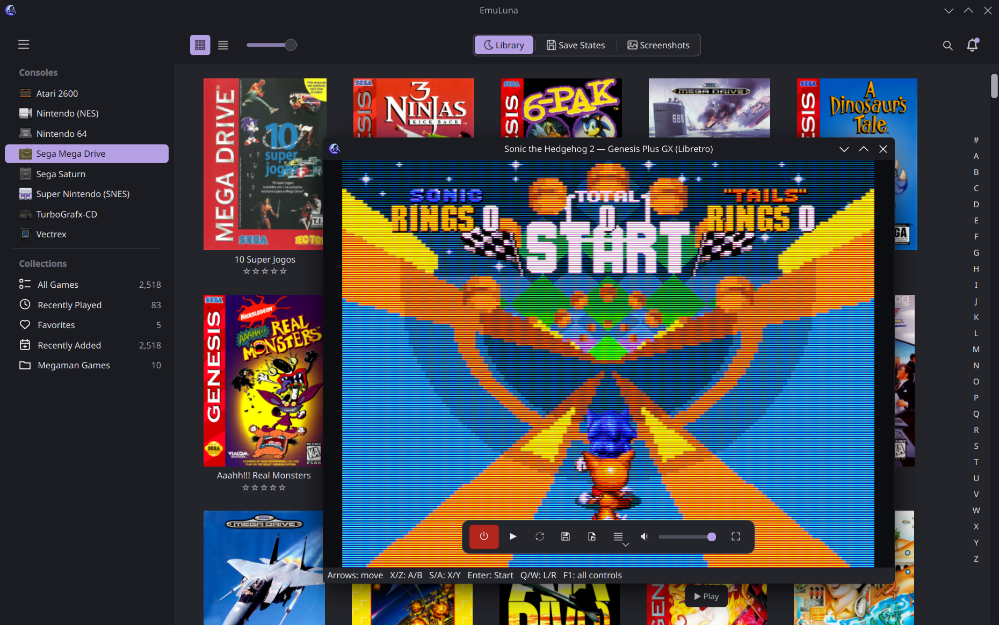

  

# EmuLuna

EmuLuna **0.13.4** is an independent desktop game library and libretro frontend.
Python/Qt provides the interface, SQLite stores the library, and a reusable C++
host loads standard, unmodified libretro cores directly. It does not launch
RetroArch. Linux is tested; Windows remains a development target.

  

  <a href="https://buymeacoffee.com/turgo"><strong>☕ Buy me a coffee and support EmuLuna</strong></a>

## Website

Visit [emuluna-retro-library.turgo82.chatgpt.site](https://emuluna-retro-library.turgo82.chatgpt.site).

## Run

Open **Launch EmuLuna.sh**, or run `./run.sh`. The supplied native build is for
Linux x86_64. Python 3 and PySide6 are required; SDL2 enables gamepads. The local
`EmuLuna.desktop` shortcut uses the new moon/controller icon. It contains paths
for this checkout; regenerate those paths if you move the folder.

For a fresh native build, install a C++14 compiler, CMake and Ninja, then run
`./build.sh`. Python dependencies are in `requirements.txt`. `CMAKE`, `CXX` and
`BUILD_JOBS` can customize the build environment.

## AppImage

Run `./packaging/appimage/build-appimage.sh` to create a self-contained x86_64
AppImage in `dist/`. The build compiles the native host, bundles Python, PySide6,
Qt plugins and application assets with PyInstaller, then wraps that directory
with `appimagetool`. The first build downloads its isolated Python build tools
and `appimagetool`; later builds reuse them. Set `APPIMAGETOOL` to use an existing
copy, `VERSION` to override the filename version, or `OUTPUT` to choose another
destination. Build releases on the oldest Linux distribution you intend to
support because glibc compatibility follows the build host. Downloaded cores,
ROMs, BIOS files and the SQLite library remain in the user's normal data folder
and are not embedded in the AppImage.

Tagged GitHub revisions matching `v*` run the same build on Ubuntu 22.04 and
publish the AppImage plus `SHA256SUMS` through GitHub Releases. A manual run of
the release workflow builds and retains the package as an Actions artifact
without creating a public release.

## Library

Import ROMs through ☰ → Library or drag them into the window. Managed
imports preserve original filenames and source files; external storage is also
available. Import folders, ZIPs and supported disc sets. Disc imports inspect data-track
signatures for PlayStation, PSP, Sega CD, Saturn and PC Engine CD. Choosing a BIN
with one matching CUE sheet imports the whole set. Keep CUE/CCD files, data and
audio tracks together; M3U playlists remain one game. Missing references and
conflicting console signatures produce a specific import issue.

Unidentified discs automatically open the console picker. Select several files
for the same console, choose it, and click **Import selected discs**. Only
compatible disc systems are offered. CHD v3–v5 headers are recognized, but CHD
payloads are not decompressed for identification: choose the console explicitly.
A lone disc BIN needs its CUE sheet; the importer does not invent missing audio
or track layouts. Saturn/PCE CD ISO files need an accompanying CUE or CHD for
the available cores. File hashes and managed copies are streamed, preserving
original files and names. Problem imports appear
in the notification bell, with an action to resolve them.

The hamburger menu above the consoles contains Library, Artwork, Game information
and Help, plus a direct Settings entry. Press F10 to open it; existing keyboard shortcuts still work.
The sidebar contains alphabetically ordered consoles followed by
protected built-in and user collections. Library, Save States and Screenshots
sit in the center of the top toolbar with their icons (icons only in small windows).
View and cover-size controls stay on the left, with Search and the notification
bell on the right.
**Settings → General → Use system theme colors** follows the OS palette by
default, including selection accents and live theme changes. Turn it off for
EmuLuna’s dark theme. Library, Save States and Screenshots share image-only
selection outlines and hover highlights. Help → About displays the EmuLuna app icon.
**Settings → Library → Hide consoles with no
games** hides empty systems immediately. It does not change core installation,
collections or search, and newly imported systems appear automatically.

Use Grid/List, search and the freely adjustable cover-size slider. The #–Z strip
on the right jumps to the first matching title in the current console, collection
and search results. It works in grid and list views without changing their sort
order; unavailable letters are dimmed. # groups numbers and non-Latin initials.
**Settings → Library → Show alphabet index** shows or hides it immediately.
The scrollbar sits to its right and follows the selected theme. Double-click
the slider to reset its size. Covers load in the background with nearby rows
prefetched. Missing artwork uses each console’s usual box proportions; actual
images retain their own proportions, including alternate regional packaging.
Loading placeholders match the incoming image dimensions. Cards always show rating stars. Select multiple games to rate them,
add them to collections, consolidate files or change metadata. Selection only
highlights the cover.

Hover for **Play/Resume**. Double-click and Return also resume a compatible
automatic save. The curved-arrow **Restart** action asks before clearing that
automatic save. Failed resumes preserve it, even after unpausing. Manual states
and in-game saves are separate. Automatic states are saved silently when closing
a game, not periodically.

The bell beside Search holds session notifications, import progress, unresolved
import issues and task cancellation controls. No bottom labels or log bar remain.
Save States are grouped by console; screenshots have their own library. Open
media with double-click, Return or its context menu.
New manual and automatic states capture a native-resolution screenshot beside
the state file. State cards show that moment with box art in the lower-right
corner. Older states show “No screenshot” until saved again; missing box art
uses the console icon. These previews do not appear in the Screenshots library.

## Cores, BIOS and gameplay

Settings offers 27 downloadable official libretro cores for 32 system entries,
per-system defaults, core removal/update and **Install all cores**. Recommended
cores can download when importing supported games. Removing a core preserves
ROMs and saves. Existing working cores are never updated automatically: downloads
and updates require an explicit action in Core downloads. When a core is updated,
EmuLuna retains its previous binary and offers **Restore previous** so regressions
can be rolled back without mixing save states between core builds. The BIOS
checklist checks required filenames and known hashes; users supply BIOS files
themselves.

SNES, NES, GB/GBC/GBA and N64 have received execution tests. N64 uses a software
renderer. Download availability does not establish gameplay compatibility for
every system. PSP and Vectrex currently need unsupported hardware rendering.
CUE/BIN, CCD sets and M3U playlists preserve referenced files on import; runtime
disc switching is still planned.

Move the mouse during gameplay to reveal the HUD. It offers pause, stop, save,
load, volume, fullscreen and Options. F5 saves, F8 loads, F11 toggles fullscreen,
F12 captures the native game image, Ctrl+P pauses and Ctrl+R resets. Settings →
Controls provides saved keyboard and SDL controller mappings for every catalog
console and each supported player. Player 1–4 input is sent to separate libretro
ports; connected controllers can be assigned by SDL order. Click a binding and
press the physical button, shoulder, stick click, stick direction or analog
trigger. Right-click a binding to choose from the complete input list. Changes
also reach running games without restarting them.
Controller artwork shows each system's physical button layout,
including shoulders, triggers, keypad controllers and handhelds. Click a control
in the illustration to remap it. Artwork keeps its proportions when Settings is
resized; bindings stay in a separate scrollable panel. Settings follows either
the system palette or EmuLuna's dark palette, including checkmarks and arrows.

**Controller artwork credit: Pinapple_Graphics**, from
`Controller_Vectors_by_Pinapple_Graphics_(Normal_300ppi)_v2.1`, supplied by the
user. All matching artwork has been converted and checked: 24 images cover
27 systems, including handhelds, analog gamepads, joysticks and keypad controllers.
App copies use transparent, lossless WebP with a maximum dimension of 1100 px;
the supplied originals remain unchanged. Atari 5200, Odyssey², SG-1000,
monochrome Neo Geo Pocket and monochrome WonderSwan retain the existing EmuLuna
illustrations because matching images were not supplied. Rear triggers and other
controls absent from a front-view image remain configurable in the binding list.
See `emuluna/data/controllers/artwork_manifest.json` for source filenames,
hashes and conversion details, and `THIRD_PARTY_NOTICES.md` for attribution.

Right-click a console in the sidebar → **Configure Controls…** opens that
console's bindings directly. Right-click selected games → **Remove from
library…** to keep the ROM files, or **Move game files to Trash…** to discard
them. The confirmation previews affected paths and offers separate save-state
and screenshot checkboxes, both off by default. Only the imported copy is
trashed for managed games; external libraries trash the referenced files.
Disc companions are included and tracks shared with remaining games are kept.
Battery saves remain intact. A Trash failure never falls back to permanent deletion.

In **Save States** or **Screenshots**, right-click an individual item →
**Move … to Trash…** to remove it without removing the game. Deleting a state
also removes its preview. Close a running game before removing its files/media.

**Options → Video Filter** has an alphabetical preset list and **Configure
Shader…**, following OpenEmu's organization. It includes the same 19 bundled
Slang presets (CRT Geom/Deluxe, CRT Royale Kurozumi, NTSC/VCR, LCD PSP, MAME HLSL,
Motion Blur, xBRZ and others), plus the previous zfast CRT/LCD, CRT EasyMode and
Sharp Bilinear presets. Configuration changes take effect live and are saved per
console. All presets are also available as the default in Gameplay settings.

The game display uses desktop OpenGL 3.3 with the extensions needed by the
selected preset. Core frames are uploaded at native resolution, effects run in
GPU framebuffers, and the result is presented directly by QOpenGLWidget. There
is no GPU-to-CPU readback or CPU rescaling of filtered frames during gameplay.
Render targets, textures, uniforms and paused output are reused. Screenshots
and save-state previews still use the original core image.

The configuration dialog identifies the graphics renderer, marks GPU demand,
and offers 1080p/720p filter-resolution limits for expensive presets on large
displays. Known software renderers such as llvmpipe fall back to an unfiltered
display with a notice instead of silently running expensive filters on the CPU.
Failures keep the saved filter preference for a future session. CRT Royale uses
at least 640 × 480 internally to avoid unstable bloom at small window sizes.

See `emuluna/data/shaders/README.md` for sources, authors, compatibility and
licenses. Only the bundled preset vocabulary is supported; arbitrary preset
import is not offered yet.

## Existing libraries and compatibility

New installations use `${XDG_DATA_HOME:-~/.local/share}/emuluna`. If that library
does not exist but a previous `openemu-linux/library.sqlite3` does, EmuLuna opens
the previous library in place. No automatic move, deletion or ROM renaming occurs.
Use `--data-dir` or `EMULUNA_DATA_DIR` for a specific library. The previous
`OPENEMU_DATA_DIR` variable is accepted for compatibility.

Database IDs, core hashes, SRAM locations, state filenames and state wire format
remain stable, so rebranding does not invalidate existing saves. The legacy
`.oesavestate` extension and `OELINUX1` marker describe our previous frontend's
format, not a dependency on macOS OpenEmu. OpenVGDB's external `openemu.system.*`
identifiers are retained solely to query its catalog correctly.

## Independent source tree

This folder contains the active app, native host, tests, original diagnostic
cartridges, documentation and app assets. It excludes the original OpenEmu
macOS application, Cocoa/AppKit source, Xcode workspaces, historical adapter/core
checkouts and old build/test debris. That source tree is archived separately in
`../../work/archive/OpenEmu-Linux-before-EmuLuna` for provenance and recovery.

The frontend and C++ host are original project code. The libretro API header,
community shaders and runtime dependencies retain their licenses and credits.
See [THIRD_PARTY_NOTICES.md](THIRD_PARTY_NOTICES.md). Existing copyright notices
remain where required. The main app icon was generated for EmuLuna; its original
prompt and provenance are in `emuluna/data/branding/README.md`. The console icons use OpenEmu PNG artwork, restored at the user’s request;
source paths and hashes are in `emuluna/data/icons/`. Original SVG badges remain
available as alternatives. Asset reuse rights have not been independently verified.

## Tests and remaining work

Run `QT_QPA_PLATFORM=offscreen PYTHONPATH=. python3 -m unittest discover -s tests`.
Set `EMULUNA_TEST_LIBRETRO_DIR` to a test library with downloaded standard cores
for integration checks. Shader integration checks use a headless EGL context when available and report
the actual GL renderer; that does not certify physical GPU performance.
No copyrighted ROMs or BIOS files are bundled; diagnostics are original CC0 code.

Controller remapping/multiplayer, unlimited named-state management, cheats,
rewind, hardware-core rendering, disc switching and Windows packaging remain
in progress. See [ROADMAP.md](ROADMAP.md). This rebrand is not a claim that every
feature in the wider roadmap is finished.
